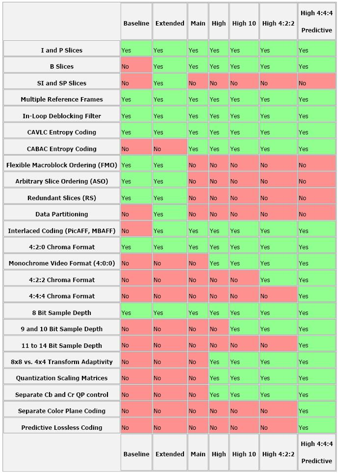
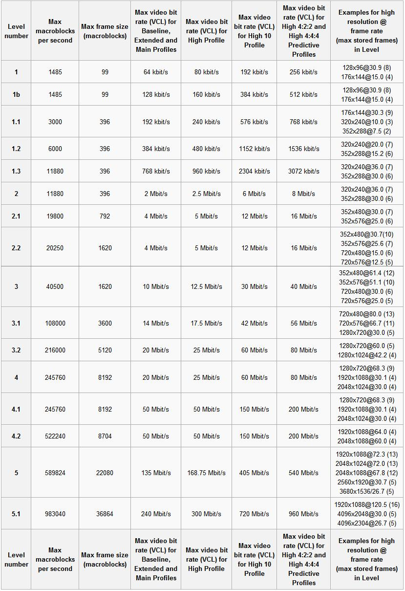
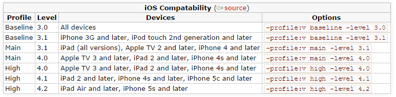
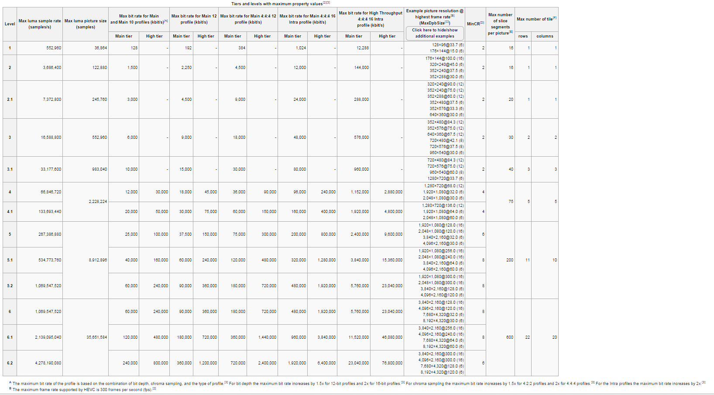

### FFMPEG 命令详解 [http://www.cnblogs.com/frost-yen/p/5848781.html](http://www.cnblogs.com/frost-yen/p/5848781.html)

>   ffmpeg [[options][`-i' input_file]]... {[options] output_file}...

>   ffmpeg -filters # 查看支持的滤镜

>   ffmpeg -version # 查看安装信息

##### 1 获取视屏指定时间的图片
```bash
    ffmpeg -i video.mp4 -ss 00:00:00  -f image2 -y image_00.jpg
```  

##### 2 视频转换
```bash
    ffmpeg -i input.avi output.mp4 
    ffmpeg -i video.mp4 video.ts
```

##### 3 提取音频(没有视屏)
```bash
    ffmpeg -i video.mp4 -acodec copy -vn video.aac
    ffmpeg -i video.mp4 -acodec aac  -vn video.aac #默认mp4的audio codec是aac
```

##### 4 提取视频(没有声音)
```bash
    ffmpeg -i video.mp4 -vcodec copy -an video_output.mp4
```

##### 5 视频剪切(从时间为00:00:05开始, 截取5秒钟) 
```bash
    ffmpeg -ss 00:00:05 -t 00:00:05 -i video.mp4 -vcodec copy -acodec copy video_crop.mp4 
```

##### 6 码率控制(码率控制对于在线视频比较重要, 在线视频需要考虑其能提供的带宽)
>   bitrate = file size / duration 
    比如一个文件20.8M, 时长1分钟, 码率就是: biterate = 20.8M bit/60s = 20.8*1024*1024*8 bit/60s= 2831Kbps 
    一般音频的码率只有固定几种, 比如是128Kbps, 则video的就是 video biterate = 2831Kbps -128Kbps = 2703Kbps
    ffmpeg控制码率有3种选择, -minrate -b:v -maxrate 
    -b:v主要是控制平均码率(比如一个视频源的码率太高了, 有10Mbps, 文件太大, 想把文件弄小一点, 但是又不破坏分辨率)
  
```bash
ffmpeg -i video.mp4 -b:v 500k video_output.mp4 
```

>   上面把码率从原码率转成2Mbps码率, 这样其实也间接让文件变小了. 目测接近一半.  
    不过, ffmpeg官方wiki比较建议, 设置b:v时, 同时加上 -bufsize 
    ffmpeg -i input.mp4 -b:v 2000k -bufsize 2000k output.mp4
    -bufsize 用于设置码率控制缓冲器的大小, 设置的好处是, 让整体的码率更趋近于希望的值, 减少波动. (简单来说, 比如1 2的平均值是1.5,  1.49 1.51 也是1.5, 当然是第二种比较好) 
    -maxrate 可以使得视频的码率波动不超过一个阈值(尤其是在线视屏)
    
```bash
    ffmpeg -i video.mp4 -b:v 2000k -bufsize 2000k video_output.mp4
    ffmpeg -i video.mp4 -b:v 2000k -bufsize 2000k -maxrate 2500k video_output.mp4
```

##### 7 视频编码格式转换
```bash
    ffmpeg -i video.mp4 -vcodec h264 video_output.mp4   # 将视屏编码格式转换为 h264
    ffmpeg -i video.mp4 -vcodec mpeg4 video_output.mp4  # 将视屏编码格式转换为 mpeg4
    
    ffmpeg -i video.mp4 -c:v libx265 video_output.mp4   #用外部的编码器来编码
    ffmpeg -i video.mp4 -c:v libx264 video_output.mp4   #用外部的编码器来编码
```

##### 8 提取视频编码数据
```bash
    ffmpeg -i video.mp4 -vcodec copy -an -f m4v output.h264
```

##### 9 过滤器的使用
######9.1 将输入的1920x1080缩小到960x540输出:
```bash
    ffmpeg -i video.mp4 -vf scale=960:540 video_output.mp4 #如果540不写, 写成-1, 即scale=960:-1, 那也是可以的, ffmpeg会通知缩放滤镜在输出时保持原始的宽高比
```

######9.2 为视频添加logo
比如, 我有这么一个图片 
iqiyi logo 
想要贴到一个视频上, 那可以用如下命令: 
```bash
    # 左上角: overlay
    # 右上角: overlay=W-w 
    # 左下角: overlay=0:H-h
    # 右下角: overlay=W-w:H-h
    
    ffmpeg -i video.mp4 -i logo.jpg -filter_complex overlay video_logo.mp4
``` 


##### 10 去掉视频的logo(编译ffmpge一定要加–enable-gpl, 不然使用时会提示 no such filter 'delogo')
>   -vf delogo=x:y:w:h[:t[:show]] 
    x:y     离左上角的坐标 
    w:h     logo的宽和高 
    t:      矩形边缘的厚度默认值4 
    show:   若设置为1有一个绿色的矩形, 默认值0
```bash
    ffmpeg -i video_logo.mp4 -vf delogo=0:0:220:90:100:1 video_nologo.mp4
```

##### 11 截取视频图像
```bash
    ffmpeg -i input.mp4 -r 1 -q:v 2 -f image2 pic-%03d.jpeg
    
    # -r 表示每一秒几帧 
    # -q:v表示存储jpeg的图像质量, 一般2是高质量.  
    # 如此, ffmpeg会把input.mp4, 每隔一秒, 存一张图片下来. 假设有60s, 那会有60张. 
    # 可以设置开始的时间, 和你想要截取的时间.  
    # ffmpeg -i input.mp4 -ss 00:00:20 -t 10 -r 1 -q:v 2 -f image2 pic-%03d.jpeg 
    # -ss 表示开始时间 
    # -t 表示共要多少时间.  
    # 如此, ffmpeg会从input.mp4的第20s时间开始, 往下10s, 即20~30s这10秒钟之间, 每隔1s就抓一帧, 总共会抓10帧. 
````

##### 12 序列帧与视频的相互转换
```bash
    ffmpeg -i 001.mp3 -i darkdoor.%3d.jpg -s 1024x768 -author fy -vcodec mpeg4 darkdoor.avi # 把darkdoor.[001-100].jpg序列帧和001.mp3音频文件利用mpeg4编码方式合成视频文件darkdoor.avi

    ffmpeg -i bc-cinematic-en.avi example.%d.jpg # 把视频文件导出成jpg序列帧
```

##### 13 输出YUV420原始数据
```bash
    ffmpeg -i input.mp4 output.yuv # 提取视频的YUV原始数据

    # 那如果我只想要抽取某一帧YUV呢？ 
    # 你先用上面的方法, 先抽出jpeg图片, 然后把jpeg转为YUV.  
    # 比如: 
    # 你先抽取10帧图片.  
    #  ffmpeg -i input.mp4 -ss 00:00:20 -t 10 -r 1 -q:v 2 -f image2 pic-%03d.jpeg
    
    # 然后, 你就随便挑一张, 转为YUV: 
    # ffmpeg -i pic-001.jpeg -s 1440x1440 -pix_fmt yuv420p xxx3.yuv 
    # 如果-s参数不写, 则输出大小与输入一样. 
    
    # 当然了, YUV还有yuv422p啥的, 你在-pix_fmt 换成yuv422p就行啦！
```

##### 14 H264编码profile & level控制

14.1. 背景知识(先科普一下profile&level. 这里讨论最常用的H264)
    
>H.264有四种画质级别, 分别是baseline, extended, main, high: 
 
    1. Baseline Profile：基本画质. 支持I/P 帧, 只支持无交错(Progressive)和CAVLC 
    2. Extended profile：进阶画质. 支持I/P/B/SP/SI 帧, 只支持无交错(Progressive)和CAVLC(用的少) 
    3. Main profile：主流画质. 提供I/P/B 帧, 支持无交错(Progressive)和交错(Interlaced, s也支持CAVLC 和CABAC 的支持 
    4. High profile：高级画质. 在main Profile 的基础上增加了8x8内部预测、自定义量化\无损视频编码和更多的YUV 格式 
            
>H.264 Baseline profile、Extended profile和Main profile都是针对8位样本数据、4:2:0格式(YUV)的视频序列. 在相同配置情况下, High profile(HP)可以比Main profile(MP)降低10%的码率.  
根据应用领域的不同, Baseline profile多应用于实时通信领域, Main profile多应用于流媒体领域, High profile则多应用于广电和存储领域. 

下图清楚的给出不同的profile&level的性能区别.  
profile 



level 




14.2. ffmpeg如何控制profile&level

```bash
    ffmpeg -i input.mp4 -profile:v baseline -level 3.0 output.mp4
    ffmpeg -i input.mp4 -profile:v main -level 4.2 output.mp4
    ffmpeg -i input.mp4 -profile:v high -level 5.1 output.mp4
```
如果ffmpeg编译时加了external的libx264, 那就这么写: 
```bash
    ffmpeg -i input.mp4 -c:v libx264 -x264-params "profile=high:level=3.0" output.mp4
```
    
>从压缩比例来说, baseline< main < high, 对于带宽比较局限的在线视频, 可能会选择high, 
但有些时候, 做个小视频, 希望所有的设备基本都能解码(有些低端设备或早期的设备只能解码 baseline), 
那就牺牲文件大小吧, 用baseline. 自己取舍吧！

苹果的设备对不同profile的支持.  


14.3. 编码效率和视频质量的取舍(preset, crf)

>除了上面提到的, 强行配置biterate, 或者强行配置profile/level, 还有2个参数可以控制编码效率.  
一个是preset, 一个是crf.  
preset也挺粗暴, 基本原则就是, 如果你觉得编码太快或太慢了, 想改改, 可以用profile.  
preset有如下参数可用：

>ultrafast, superfast, veryfast, faster, fast, medium, slow, slower, veryslow and placebo.   
编码加快, 意味着信息丢失越严重, 输出图像质量越差. 

>CRF(Constant Rate Factor): 范围 0-51: 0是编码毫无丢失信息, 23 is 默认, 51 是最差的情况. 相对合理的区间是18-28. 
值越大, 压缩效率越高, 但也意味着信息丢失越严重, 输出图像质量越差. 

[举个例子:](https:#trac.ffmpeg.org/wiki/Encode/H.264) 
```bash
    ffmpeg -i input -c:v libx264 -profile:v main -preset:v fast -level 3.1 -x264opts crf=18 
```

14.4. H265 (HEVC)编码tile&level控制

>和H264的profile&level一样, 为了应对不同应用的需求, HEVC制定了“层级”(tier) 和“等级”(level).  
tier只有main和high. 
 
level有13级, 如下所示: 


使用命令如下:(supposed你用libx265编码)
```bash
    ffmpeg -i input.mp4 -c:v libx265 -x265-params "profile=high:level=3.0" output.mp4
```